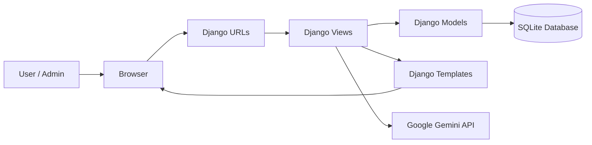
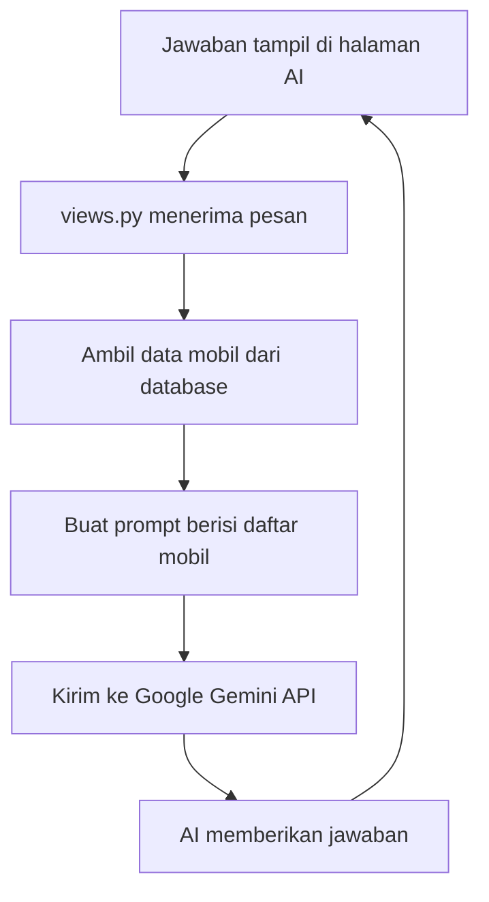
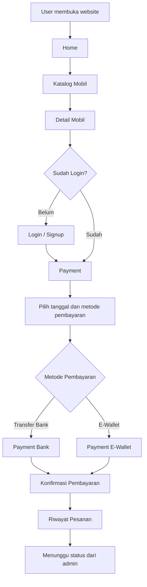
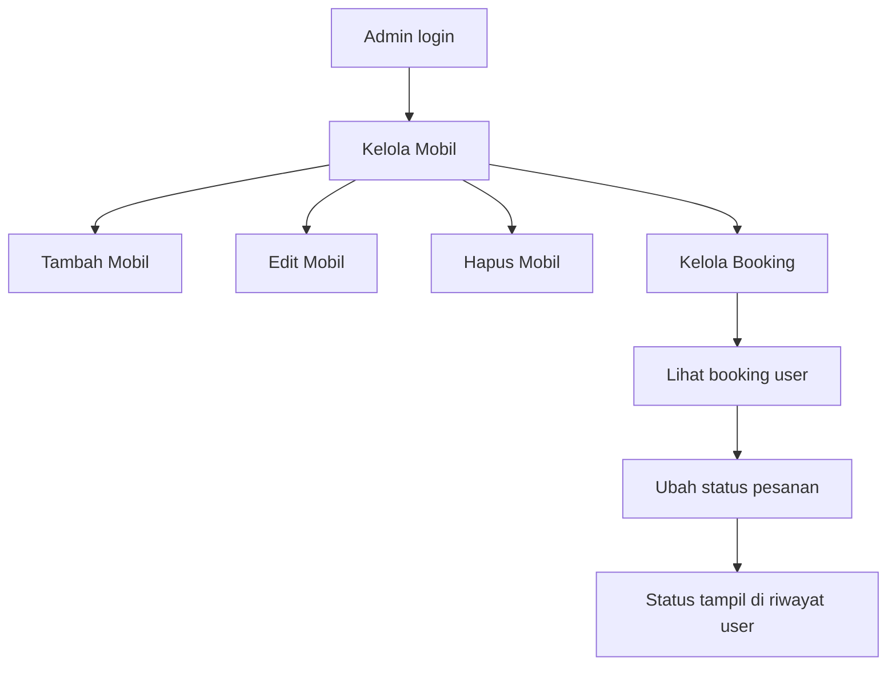
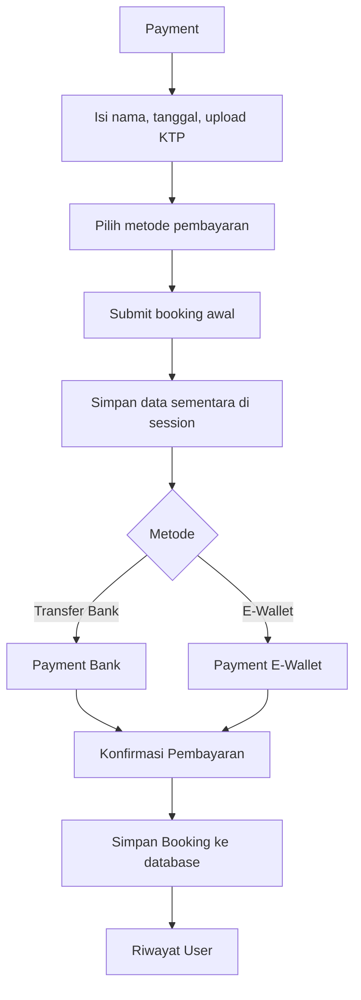
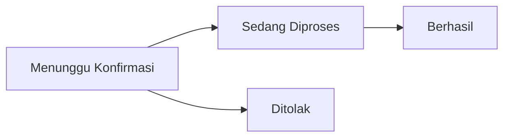

# 🚗 SmartDrive — Sistem Rental Mobil Berbasis Web dengan AI


**SmartDrive** adalah aplikasi rental mobil berbasis web yang dibuat menggunakan **Django**. Aplikasi ini membantu user melihat katalog mobil, memilih mobil, melakukan pemesanan, memilih metode pembayaran, melihat riwayat pesanan, serta membantu admin mengelola mobil dan status booking.

Project ini juga dilengkapi fitur **AI rekomendasi mobil** menggunakan **Google Gemini API**, sehingga user dapat meminta saran mobil berdasarkan jumlah penumpang, budget, dan kebutuhan perjalanan.

---

## 📌 Daftar Isi

1. [Ringkasan Project](#-ringkasan-project)
2. [Tujuan Pembuatan Aplikasi](#-tujuan-pembuatan-aplikasi)
3. [Latar Belakang](#-latar-belakang)
4. [Teknologi yang Digunakan](#-teknologi-yang-digunakan)
5. [Framework yang Digunakan](#-framework-yang-digunakan)
6. [Konsep Arsitektur Sistem](#-konsep-arsitektur-sistem)
7. [Struktur Folder Project](#-struktur-folder-project)
8. [Fitur User](#-fitur-user)
9. [Fitur Admin](#-fitur-admin)
10. [Fitur AI Rekomendasi Mobil](#-fitur-ai-rekomendasi-mobil)
11. [Alur Sistem User](#-alur-sistem-user)
12. [Alur Sistem Admin](#-alur-sistem-admin)
13. [Alur Payment dan Booking](#-alur-payment-dan-booking)
14. [Alur Status Pesanan](#-alur-status-pesanan)
15. [Model Database](#-model-database)
16. [URL Penting](#-url-penting)
17. [Cara Menjalankan Project](#-cara-menjalankan-project)
18. [Cara Menampilkan Data Mobil di Katalog Teman](#-cara-menampilkan-data-mobil-di-katalog-teman)
19. [Cara Membuat Akun Admin](#-cara-membuat-akun-admin)
20. [Cara Push dan Pull GitHub](#-cara-push-dan-pull-github)
21. [Penjelasan File Penting](#-penjelasan-file-penting)
22. [Skenario Demo Presentasi](#-skenario-demo-presentasi)
23. [Poin Presentasi ke Dosen](#-poin-presentasi-ke-dosen)
24. [Kelebihan Aplikasi](#-kelebihan-aplikasi)
25. [Kekurangan Aplikasi](#-kekurangan-aplikasi)
26. [Pengembangan Selanjutnya](#-pengembangan-selanjutnya)
27. [Troubleshooting](#-troubleshooting)
28. [Kesimpulan](#-kesimpulan)

---

## 🧾 Ringkasan Project

| Bagian | Keterangan |
|---|---|
| Nama aplikasi | SmartDrive |
| Jenis aplikasi | Sistem rental mobil berbasis web |
| Framework | Django |
| Bahasa utama | Python |
| Frontend | HTML, CSS, JavaScript |
| Database | SQLite |
| AI | Google Gemini API |
| Role pengguna | User dan Admin |
| Fitur utama | Katalog mobil, booking, payment, riwayat, admin dashboard, AI rekomendasi |

SmartDrive dibuat sebagai sistem rental mobil sederhana yang memiliki dua sisi utama, yaitu sisi **user** dan sisi **admin**.

- **User** dapat melihat katalog, memilih mobil, melakukan booking, memilih pembayaran, dan melihat riwayat.
- **Admin** dapat mengelola mobil dan mengubah status pesanan user.
- **AI** membantu user memilih mobil yang sesuai kebutuhan.

---

## 🎯 Tujuan Pembuatan Aplikasi

Tujuan utama pembuatan SmartDrive adalah untuk mempermudah proses rental mobil yang sebelumnya dapat dilakukan secara manual menjadi lebih terstruktur melalui website.

Tujuan khusus aplikasi ini adalah:

1. Memudahkan user dalam melihat daftar mobil yang tersedia.
2. Memudahkan user melihat detail mobil seperti nama, brand, transmisi, kapasitas, harga, dan gambar.
3. Memudahkan user melakukan pemesanan mobil secara online.
4. Menyediakan pilihan metode pembayaran, yaitu **Transfer Bank** dan **E-Wallet**.
5. Menyediakan fitur riwayat pesanan agar user dapat memantau status booking.
6. Membantu admin mengelola data mobil.
7. Membantu admin mengubah status pesanan user.
8. Menambahkan fitur AI agar sistem lebih interaktif dan modern.
9. Menjadi media pembelajaran penerapan Django, CRUD, autentikasi, database, session, media upload, dan API AI.

---

## 📖 Latar Belakang

Rental mobil merupakan salah satu layanan yang membutuhkan pengelolaan data secara rapi. Dalam proses manual, pelanggan biasanya harus bertanya langsung kepada admin mengenai mobil yang tersedia, harga sewa, kapasitas, serta metode pembayaran. Hal ini dapat membuat proses rental menjadi kurang efisien, terutama jika jumlah pelanggan dan kendaraan semakin banyak.

Melalui aplikasi SmartDrive, proses rental mobil dibuat lebih mudah karena user dapat langsung melihat katalog mobil melalui website. User dapat memilih mobil sesuai kebutuhan, mengatur tanggal sewa, memilih metode pembayaran, lalu memantau status pesanan melalui halaman riwayat.

Dari sisi admin, aplikasi ini membantu dalam mengelola data mobil dan memproses pesanan user. Admin dapat menambahkan mobil baru, mengedit data mobil, menghapus mobil, serta mengubah status pesanan menjadi **Menunggu Konfirmasi**, **Sedang Diproses**, **Berhasil**, atau **Ditolak**.

Selain itu, adanya fitur AI rekomendasi mobil membuat aplikasi ini lebih menarik karena user bisa mendapatkan saran mobil berdasarkan jumlah orang, budget, dan kebutuhan perjalanan.

---

## 🧰 Teknologi yang Digunakan

| Teknologi | Fungsi |
|---|---|
| Python | Bahasa pemrograman backend |
| Django | Framework web utama |
| HTML | Struktur halaman web |
| CSS | Desain tampilan website |
| JavaScript | Interaksi pada halaman, filter, kalkulasi tanggal, chat AI |
| SQLite | Database lokal |
| Django ORM | Menghubungkan model Python dengan database |
| Django Authentication | Login, logout, user, dan admin |
| Google Gemini API | AI rekomendasi/chat |
| python-dotenv | Membaca API key dari file `.env` |
| Pillow | Pengolahan gambar |
| rembg | Menghapus background gambar mobil |
| Git dan GitHub | Version control dan kolaborasi |

---

## 🧱 Framework yang Digunakan

Framework utama pada project ini adalah **Django**.

Django digunakan karena:

1. Memiliki struktur project yang rapi.
2. Mendukung konsep **MVT (Model, View, Template)**.
3. Memiliki sistem routing URL.
4. Memiliki ORM untuk database.
5. Memiliki sistem autentikasi bawaan.
6. Mendukung upload file dan gambar.
7. Cocok untuk membuat aplikasi web berbasis database.
8. Mudah digunakan untuk project akademik dan pembelajaran.

---

## 🏗️ Konsep Arsitektur Sistem

Django menggunakan pola arsitektur **MVT**, yaitu:

| Komponen | Fungsi |
|---|---|
| Model | Mengatur struktur database |
| View | Mengatur logika aplikasi |
| Template | Mengatur tampilan HTML |

### Penjelasan MVT pada SmartDrive

1. **Model**
   - Berisi struktur tabel database.
   - Contoh: `Car` dan `Booking`.

2. **View**
   - Berisi logika sistem.
   - Contoh: proses login, katalog, booking, payment, history, admin, dan AI.

3. **Template**
   - Berisi tampilan halaman web.
   - Contoh: `home.html`, `katalog.html`, `payment.html`, `admin_mobil.html`.

### Diagram Arsitektur Sederhana



---

## 📁 Struktur Folder Project

Struktur umum project SmartDrive:

```text
projek-web-lanjut/
│
├── manage.py
├── app.py
├── db.sqlite3
├── .gitignore
├── README.md
│
├── rental/
│   ├── migrations/
│   ├── fixtures/
│   │   └── cars.json
│   ├── __init__.py
│   ├── admin.py
│   ├── apps.py
│   ├── forms.py
│   ├── models.py
│   ├── urls.py
│   └── views.py
│
├── rental_mobil_ai/
│   ├── __init__.py
│   ├── settings.py
│   ├── urls.py
│   ├── asgi.py
│   └── wsgi.py
│
├── templates/
│   └── rental/
│       ├── home.html
│       ├── katalog.html
│       ├── detail.html
│       ├── payment.html
│       ├── payment_bank.html
│       ├── payment_ewallet.html
│       ├── history.html
│       ├── login.html
│       ├── signup.html
│       ├── ai.html
│       ├── admin_mobil.html
│       ├── admin_booking.html
│       ├── admin_form_mobil.html
│       └── admin_hapus_mobil.html
│
├── static/
│   └── images/
│       ├── logo-tim.png
│       ├── mobil-hitam.png
│       └── bg-mobil.jpg
│
└── media/
    └── cars/
        └── gambar-mobil-yang-diupload-admin
```

---

## 👤 Fitur User

### 1. Home

Halaman home adalah halaman awal aplikasi. Halaman ini berisi tampilan pembuka SmartDrive dan akses ke halaman lain.

Fungsi:

- Menampilkan identitas aplikasi.
- Menjadi halaman pertama yang dilihat user.
- Memberikan akses ke katalog mobil.
- Menampilkan desain awal website.

---

### 2. Katalog Mobil

Halaman katalog menampilkan daftar mobil yang tersedia.

Data yang ditampilkan:

- Gambar mobil
- Nama mobil
- Brand
- Transmisi
- Kapasitas
- Harga
- Tombol detail/sewa

Fitur pada katalog:

- Menampilkan data mobil dari database.
- Menampilkan gambar mobil dari folder `media/cars/`.
- Filter mobil berdasarkan brand.
- Filter mobil berdasarkan kapasitas.
- Filter mobil berdasarkan harga.
- Mengarahkan user ke halaman detail mobil.

---

### 3. Detail Mobil

Halaman detail menampilkan informasi lengkap dari mobil yang dipilih.

Informasi yang ditampilkan:

- Nama mobil
- Gambar mobil
- Brand
- Transmisi
- Kapasitas penumpang
- Harga per hari
- Tombol sewa sekarang

Alur:

```text
Katalog → Detail Mobil → Sewa Sekarang → Payment
```

---

### 4. Login dan Signup

Aplikasi memiliki sistem autentikasi.

Fitur login:

- User login menggunakan email dan password.
- Jika user biasa login, diarahkan ke halaman home.
- Jika admin login, diarahkan ke halaman admin mobil.

Fitur signup:

- User dapat membuat akun baru.
- Data yang diisi meliputi nama depan, nama belakang, email, nomor telepon, password, dan persetujuan syarat.

---

### 5. Payment

Halaman payment digunakan user untuk mengisi data penyewaan.

Data yang diisi:

- Nama penyewa
- Tanggal mulai sewa
- Tanggal selesai sewa
- Upload KTP
- Metode pembayaran
- Total pembayaran

Fitur penting:

- Perhitungan durasi otomatis berdasarkan tanggal.
- Total harga otomatis berubah sesuai durasi.
- Upload KTP sebagai syarat pemesanan.
- Pilihan pembayaran melalui transfer bank atau e-wallet.
- Data booking sementara disimpan menggunakan session sebelum dikonfirmasi.

---

### 6. Pembayaran Transfer Bank

Jika user memilih metode **Transfer Bank**, user diarahkan ke halaman payment bank.

Fitur:

- Pilihan bank.
- Instruksi pembayaran.
- Ringkasan mobil.
- Tanggal mulai.
- Tanggal selesai.
- Durasi.
- Total pembayaran.
- Tombol konfirmasi pembayaran.

---

### 7. Pembayaran E-Wallet

Jika user memilih metode **E-Wallet**, user diarahkan ke halaman payment e-wallet.

Fitur:

- Pilihan DANA, ShopeePay, dan GoPay.
- Tampilan QR simulasi.
- Instruksi pembayaran.
- Ringkasan mobil.
- Tanggal mulai.
- Tanggal selesai.
- Durasi.
- Total pembayaran.
- Tombol konfirmasi pembayaran.

---

### 8. Riwayat Pesanan

Riwayat digunakan untuk melihat pesanan milik user yang sedang login.

Data yang ditampilkan:

- Gambar mobil
- Nama mobil
- Tanggal sewa
- Durasi
- Total pembayaran
- Metode pembayaran
- Status pesanan

Status yang tampil:

- Menunggu Konfirmasi
- Sedang Diproses
- Berhasil
- Ditolak

---

## 🛠️ Fitur Admin

### 1. Login Admin

Admin login melalui halaman login yang sama dengan user.

Jika akun memiliki `is_staff=True` atau `is_superuser=True`, maka setelah login admin diarahkan ke:

```text
/admin-mobil/
```

---

### 2. Kelola Mobil

Halaman admin kelola mobil digunakan untuk mengatur data mobil.

Fitur:

- Melihat daftar mobil.
- Menambah mobil baru.
- Mengedit data mobil.
- Menghapus mobil.
- Upload gambar mobil.
- Mengelola nama, brand, transmisi, kapasitas, dan harga.

Jika admin menambahkan mobil baru, mobil tersebut akan tampil di katalog user.

---

### 3. Tambah Mobil

Admin dapat menambahkan mobil baru melalui form tambah mobil.

Data yang diisi:

- Nama mobil
- Brand
- Transmisi
- Kapasitas
- Harga
- Gambar mobil

---

### 4. Edit Mobil

Admin dapat mengubah data mobil yang sudah ada.

Contoh data yang bisa diedit:

- Nama mobil
- Brand
- Harga
- Kapasitas
- Transmisi
- Gambar

---

### 5. Hapus Mobil

Admin dapat menghapus mobil dari database. Jika mobil dihapus, mobil tersebut tidak akan tampil lagi di katalog.

---

### 6. Kelola Booking

Halaman kelola booking digunakan admin untuk melihat pesanan dari semua user.

Fitur:

- Melihat semua booking.
- Melihat nama penyewa.
- Melihat mobil yang dipesan.
- Melihat tanggal sewa.
- Melihat durasi.
- Melihat total pembayaran.
- Melihat metode pembayaran.
- Mengubah status pesanan.

---

### 7. Update Status Booking

Admin dapat mengubah status pesanan menjadi:

| Status | Fungsi |
|---|---|
| Menunggu Konfirmasi | Pesanan masuk, pembayaran belum dicek |
| Sedang Diproses | Admin sedang mengecek pembayaran |
| Berhasil | Pembayaran valid dan pesanan diterima |
| Ditolak | Pembayaran tidak valid atau pesanan dibatalkan |

---

## 🤖 Fitur AI Rekomendasi Mobil

SmartDrive memiliki fitur AI yang membantu user memilih mobil.

AI bekerja dengan membaca data mobil dari database, lalu memberikan rekomendasi berdasarkan pertanyaan user.

Contoh pertanyaan:

```text
Saya mau sewa mobil untuk 7 orang dengan budget 500 ribu.
```

Contoh jawaban:

```text
Untuk 7 orang, saya rekomendasikan Avanza Veloz karena kapasitasnya cukup untuk keluarga dan harganya masih sesuai budget.
```

### Cara Kerja AI



### Data yang dipertimbangkan AI

- Nama mobil
- Brand mobil
- Harga
- Kapasitas
- Transmisi
- Kebutuhan user
- Budget user

---

## 🔄 Alur Sistem User



Penjelasan:

1. User membuka website.
2. User masuk ke katalog.
3. User memilih mobil.
4. User membuka detail mobil.
5. User login jika belum login.
6. User mengisi payment.
7. User memilih metode pembayaran.
8. User melakukan konfirmasi pembayaran.
9. Data booking tersimpan.
10. User melihat status pesanan di halaman riwayat.

---

## 🔐 Alur Sistem Admin



Penjelasan:

1. Admin login.
2. Admin diarahkan ke halaman kelola mobil.
3. Admin dapat menambah, mengedit, dan menghapus mobil.
4. Admin membuka halaman kelola booking.
5. Admin melihat pesanan user.
6. Admin mengubah status pesanan.
7. Status yang diubah langsung terlihat di riwayat user.

---

## 💳 Alur Payment dan Booking

Pada project ini, booking tidak langsung disimpan saat user baru memilih metode pembayaran. Data pemesanan disimpan sementara terlebih dahulu menggunakan **session**. Booking baru benar-benar tersimpan setelah user menekan tombol **Konfirmasi Pembayaran**.



Rumus total pembayaran:

```text
Total Pembayaran = Harga Mobil per Hari × Durasi Sewa
```

Contoh:

```text
Harga mobil per hari = Rp 300.000
Durasi = 3 hari
Total = 300.000 × 3
Total = Rp 900.000
```

---

## 📌 Alur Status Pesanan

Status booking digunakan untuk memberi informasi kepada user.



Penjelasan:

| Status | Keterangan |
|---|---|
| Menunggu Konfirmasi | Booking sudah masuk, tetapi admin belum mengecek pembayaran |
| Sedang Diproses | Admin sedang mengecek pembayaran |
| Berhasil | Pembayaran sudah valid dan pesanan diterima |
| Ditolak | Pembayaran tidak valid atau pesanan dibatalkan |

---

## 🗄️ Model Database

### 1. Model Car

Model `Car` digunakan untuk menyimpan data mobil.

Field utama:

| Field | Tipe | Fungsi |
|---|---|---|
| name | CharField | Nama mobil |
| brand | CharField | Brand mobil |
| transmission | CharField | Jenis transmisi |
| capacity | IntegerField | Kapasitas penumpang |
| price | IntegerField | Harga sewa per hari |
| image | ImageField | Gambar mobil |

Contoh kode:

```python
class Car(models.Model):
    name = models.CharField(max_length=100)
    brand = models.CharField(max_length=100)
    transmission = models.CharField(max_length=50)
    capacity = models.IntegerField()
    price = models.IntegerField()
    image = models.ImageField(upload_to='cars/', blank=True, null=True)
```

---

### 2. Model Booking

Model `Booking` digunakan untuk menyimpan data pesanan.

Field utama:

| Field | Tipe | Fungsi |
|---|---|---|
| user | ForeignKey | User yang melakukan booking |
| car | ForeignKey | Mobil yang dipesan |
| nama | CharField | Nama penyewa |
| mobil | CharField | Nama mobil |
| tanggal | DateField | Tanggal mulai sewa |
| hari | IntegerField | Durasi sewa |
| total | IntegerField | Total pembayaran |
| metode_pembayaran | CharField | Bank atau E-Wallet |
| bank_pembayaran | CharField | Nama bank jika digunakan |
| status | CharField | Status booking |
| created_at | DateTimeField | Waktu booking dibuat |

Contoh kode:

```python
class Booking(models.Model):
    STATUS_CHOICES = [
        ('menunggu', 'Menunggu Konfirmasi'),
        ('diproses', 'Sedang Diproses'),
        ('selesai', 'Berhasil'),
        ('ditolak', 'Ditolak'),
    ]

    user = models.ForeignKey(User, on_delete=models.CASCADE, null=True, blank=True)
    car = models.ForeignKey(Car, on_delete=models.SET_NULL, null=True, blank=True)
    nama = models.CharField(max_length=100)
    mobil = models.CharField(max_length=100)
    tanggal = models.DateField()
    hari = models.IntegerField()
    total = models.IntegerField()
    metode_pembayaran = models.CharField(max_length=50, blank=True, null=True)
    bank_pembayaran = models.CharField(max_length=50, blank=True, null=True)
    status = models.CharField(max_length=30, choices=STATUS_CHOICES, default='menunggu')
    created_at = models.DateTimeField(auto_now_add=True)
```

---

## 🌐 URL Penting

| URL | Nama URL | Fungsi |
|---|---|---|
| `/` | `home` | Halaman utama |
| `/katalog/` | `katalog` | Halaman katalog mobil |
| `/detail/<car_id>/` | `detail_mobil` | Detail mobil |
| `/login/` | `login` | Login user/admin |
| `/signup/` | `signup` | Daftar user baru |
| `/logout/` | `logout` | Logout |
| `/payment/<car_id>/` | `payment` | Form payment |
| `/booking/<car_id>/` | `booking` | Proses booking awal |
| `/payment-bank/<car_id>/` | `payment_bank` | Pembayaran bank |
| `/payment-ewallet/<car_id>/` | `payment_ewallet` | Pembayaran e-wallet |
| `/konfirmasi-payment/<car_id>/<metode>/` | `konfirmasi_payment` | Konfirmasi pembayaran |
| `/history/` | `history` | Riwayat booking user |
| `/admin-mobil/` | `admin_mobil` | Admin kelola mobil |
| `/admin-mobil/tambah/` | `admin_tambah_mobil` | Tambah mobil |
| `/admin-mobil/edit/<car_id>/` | `admin_edit_mobil` | Edit mobil |
| `/admin-mobil/hapus/<car_id>/` | `admin_hapus_mobil` | Hapus mobil |
| `/admin-booking/` | `admin_booking` | Admin kelola booking |
| `/admin-booking/update/<booking_id>/` | `admin_update_status` | Update status booking |
| `/ai/` | `ai` | Halaman AI rekomendasi |
| `/ai/chat/` | `ai_chat` | Endpoint chat AI |
| `/api/cars/` | `api_cars` | Endpoint JSON data mobil |

---

## ▶️ Cara Menjalankan Project

### 1. Clone Repository

```bash
git clone https://github.com/JustYuzo/projek-web-lanjut.git
cd projek-web-lanjut
```

---

### 2. Buat Virtual Environment

```bash
python -m venv venv
```

Aktifkan virtual environment di Windows:

```bash
venv\Scripts\activate
```

Jika berhasil, terminal akan menampilkan:

```bash
(venv)
```

---

### 3. Install Library

Jika ada file `requirements.txt`, jalankan:

```bash
pip install -r requirements.txt
```

Jika belum ada, install manual:

```bash
pip install django python-dotenv google-genai pillow rembg
```

Catatan: `rembg` digunakan untuk proses remove background gambar mobil. Jika terjadi error saat install `rembg`, project masih bisa dijalankan dengan menghapus bagian import dan proses `remove()` pada `models.py`, atau install ulang dependency sesuai kebutuhan.

---

### 4. Buat File `.env`

Buat file `.env` di folder utama project, sejajar dengan `manage.py`.

Isi:

```env
GEMINI_API_KEY=isi_api_key_gemini_kamu
```

Jika belum memiliki API key, fitur AI tidak akan berjalan penuh, tetapi fitur rental mobil tetap dapat digunakan.

---

### 5. Jalankan Migration

```bash
python manage.py makemigrations
python manage.py migrate
```

---

### 6. Jalankan Server

```bash
python manage.py runserver
```

Buka browser:

```text
http://127.0.0.1:8000/
```

---

## 🚘 Cara Menampilkan Data Mobil di Katalog Teman

Data mobil yang diinput melalui admin tersimpan di database lokal. Karena itu, data mobil tidak otomatis muncul di laptop teman hanya dengan `git pull`.

Agar katalog teman muncul, gunakan fixture.

### Di Laptop Pembuat Project

Export data mobil:

```bash
New-Item -ItemType Directory -Force rental\fixtures
python manage.py dumpdata rental.Car --indent 2 > rental/fixtures/cars.json
```

Push ke GitHub:

```bash
git add .
git commit -m "menambahkan data dan gambar mobil katalog"
git push origin main
```

---

### Di Laptop Teman

Pull update:

```bash
git pull origin main
```

Aktifkan venv:

```bash
venv\Scripts\activate
```

Jalankan migration:

```bash
python manage.py migrate
```

Load data mobil:

```bash
python manage.py loaddata cars.json
```

Jalankan server:

```bash
python manage.py runserver
```

Buka katalog:

```text
http://127.0.0.1:8000/katalog/
```

---

## 🔑 Cara Membuat Akun Admin

Akun admin tidak otomatis ikut dari database laptop pembuat project. Setiap laptop perlu membuat admin sendiri.

Jalankan:

```bash
python manage.py createsuperuser
```

Isi username, email, dan password.

Setelah berhasil, login melalui halaman login.

Jika user adalah staff/superuser, sistem akan mengarahkan ke halaman:

```text
/admin-mobil/
```

---

## 🔃 Cara Push dan Pull GitHub

### Push dari Laptop Pembuat Project

```bash
git status
git add .
git commit -m "update final smartdrive"
git push origin main
```

---

### Pull di Laptop Teman

Jika teman sudah clone project:

```bash
cd projek-web-lanjut
venv\Scripts\activate
git pull origin main
python manage.py migrate
python manage.py loaddata cars.json
python manage.py runserver
```

Jika teman belum clone project:

```bash
git clone https://github.com/JustYuzo/projek-web-lanjut.git
cd projek-web-lanjut
python -m venv venv
venv\Scripts\activate
pip install django python-dotenv google-genai pillow rembg
python manage.py migrate
python manage.py loaddata cars.json
python manage.py runserver
```

---

## 📄 Penjelasan File Penting

### `manage.py`

File utama untuk menjalankan perintah Django, seperti:

```bash
python manage.py runserver
python manage.py migrate
python manage.py createsuperuser
```

---

### `rental/models.py`

Berisi model database seperti `Car` dan `Booking`.

---

### `rental/views.py`

Berisi logika aplikasi, seperti:

- Home
- Katalog
- Detail mobil
- Login
- Signup
- Payment
- Booking
- Konfirmasi payment
- History
- Admin mobil
- Admin booking
- AI chat

---

### `rental/urls.py`

Berisi daftar URL untuk aplikasi rental.

---

### `templates/rental/`

Berisi semua file tampilan HTML.

---

### `static/images/`

Berisi gambar statis seperti logo dan background.

---

### `media/cars/`

Berisi gambar mobil yang diupload oleh admin.

---

### `.env`

Berisi API key Gemini.

File ini sebaiknya tidak dipush ke GitHub karena berisi data rahasia.

---

## 🎤 Skenario Demo Presentasi

Urutan demo yang disarankan saat presentasi ke dosen:

1. Buka halaman home.
2. Jelaskan bahwa SmartDrive adalah sistem rental mobil berbasis web.
3. Masuk ke halaman katalog.
4. Tunjukkan daftar mobil.
5. Gunakan filter katalog jika tersedia.
6. Pilih salah satu mobil.
7. Masuk ke halaman detail mobil.
8. Klik sewa sekarang.
9. Login sebagai user.
10. Isi payment.
11. Pilih tanggal mulai dan tanggal selesai.
12. Upload KTP.
13. Pilih metode pembayaran.
14. Masuk ke payment bank atau e-wallet.
15. Klik konfirmasi pembayaran.
16. Masuk ke riwayat user.
17. Login sebagai admin.
18. Buka kelola booking.
19. Ubah status pesanan.
20. Kembali ke riwayat user dan tunjukkan status berubah.
21. Buka fitur AI.
22. Tanya AI rekomendasi mobil.
23. Jelaskan kelebihan dan kekurangan aplikasi.

---

## 🧑‍🏫 Poin Presentasi ke Dosen

Saat presentasi, bagian yang bisa dijelaskan:

1. **Nama aplikasi:** SmartDrive.
2. **Jenis aplikasi:** rental mobil berbasis web.
3. **Framework:** Django.
4. **Bahasa:** Python.
5. **Frontend:** HTML, CSS, JavaScript.
6. **Database:** SQLite.
7. **Konsep:** MVT.
8. **Role:** User dan Admin.
9. **Fitur user:** katalog, detail, payment, riwayat, AI.
10. **Fitur admin:** kelola mobil dan kelola booking.
11. **Alur user:** katalog → detail → payment → pembayaran → riwayat.
12. **Alur admin:** login → kelola mobil → kelola booking → update status.
13. **AI:** menggunakan Google Gemini API.
14. **Keunggulan:** terdapat rekomendasi mobil berbasis AI.
15. **Kekurangan:** payment masih simulasi.
16. **Pengembangan:** payment gateway, invoice, notifikasi, dan deploy.

---

## ✅ Kelebihan Aplikasi

1. Tampilan modern dan mudah dipahami.
2. Memiliki fitur login dan signup.
3. Memiliki role user dan admin.
4. User dapat melihat katalog mobil.
5. User dapat melihat detail mobil.
6. User dapat melakukan booking online.
7. User dapat memilih tanggal mulai dan selesai.
8. Total harga dihitung otomatis berdasarkan durasi.
9. User dapat memilih metode pembayaran bank atau e-wallet.
10. User dapat melihat riwayat pesanan.
11. Admin dapat mengelola data mobil.
12. Admin dapat mengelola status booking.
13. Gambar mobil dapat diupload.
14. Terdapat fitur AI rekomendasi mobil.
15. Cocok sebagai project pembelajaran Django.

---

## ⚠️ Kekurangan Aplikasi

1. Pembayaran masih simulasi.
2. QR e-wallet belum terhubung ke payment gateway asli.
3. Bukti pembayaran belum diverifikasi otomatis.
4. Belum ada invoice PDF.
5. Belum ada notifikasi email.
6. Belum ada notifikasi WhatsApp.
7. Belum ada dashboard statistik admin.
8. Belum ada pengecekan ketersediaan mobil berdasarkan tanggal secara otomatis.
9. Database masih SQLite.
10. Belum ada sistem rating dan review mobil.

---

## 🚀 Pengembangan Selanjutnya

Fitur yang dapat ditambahkan:

1. Integrasi payment gateway asli.
2. Upload bukti transfer.
3. Verifikasi pembayaran otomatis.
4. Invoice PDF.
5. Notifikasi email.
6. Notifikasi WhatsApp.
7. Dashboard statistik admin.
8. Kalender ketersediaan mobil.
9. Fitur rating dan review.
10. Sistem denda keterlambatan.
11. Export laporan booking.
12. Deploy ke hosting atau VPS.
13. Mengganti SQLite ke PostgreSQL/MySQL.
14. Membuat API khusus mobile app.

---

## 🧩 Troubleshooting

### 1. Katalog Kosong

Penyebab:

- Data mobil belum masuk database.
- Belum menjalankan `loaddata`.

Solusi:

```bash
python manage.py loaddata cars.json
```

---

### 2. Gambar Mobil Tidak Muncul

Cek `settings.py`:

```python
MEDIA_URL = '/media/'
MEDIA_ROOT = BASE_DIR / 'media'
```

Cek `urls.py` project:

```python
from django.conf import settings
from django.conf.urls.static import static

if settings.DEBUG:
    urlpatterns += static(settings.MEDIA_URL, document_root=settings.MEDIA_ROOT)
```

Pastikan file gambar ada di:

```text
media/cars/
```

---

### 3. Error CSRF Saat Simpan Status

Penyebab:

- Halaman lama.
- Token CSRF expired.
- Form belum memakai ``.

Solusi:

1. Tekan `CTRL + F5`.
2. Pastikan form memiliki:

```html

```

---

### 4. AI Gemini Error

Penyebab:

- `.env` belum dibuat.
- API key belum diisi.
- API key salah.
- Kuota API habis.

Solusi:

1. Buat file `.env`.
2. Isi:

```env
GEMINI_API_KEY=isi_api_key_kamu
```

3. Restart server.

---

### 5. ModuleNotFoundError

Jika muncul error module belum terinstall, install dependency:

```bash
pip install django python-dotenv google-genai pillow rembg
```

---

### 6. Migration Error

Jalankan:

```bash
python manage.py makemigrations
python manage.py migrate
```

---

### 7. Login Admin Tidak Masuk Dashboard

Pastikan akun admin memiliki status staff.

Solusi cepat:

```bash
python manage.py createsuperuser
```

Lalu login menggunakan akun superuser tersebut.

---

## 🔒 Catatan Keamanan

1. Jangan upload file `.env` ke GitHub.
2. Jangan tampilkan API key Gemini di README atau kode publik.
3. Jangan gunakan `DEBUG=True` saat deploy production.
4. Jangan gunakan `SECRET_KEY` asli di repository publik untuk production.
5. Gunakan database yang lebih aman seperti PostgreSQL jika aplikasi benar-benar digunakan.
6. Validasi file upload agar user tidak mengupload file berbahaya.
7. Gunakan payment gateway resmi jika pembayaran dibuat nyata.

---

## 🧠 Materi yang Bisa Dipelajari dari Project Ini

Dari project SmartDrive, mahasiswa dapat mempelajari:

1. Dasar framework Django.
2. Konsep MVT.
3. Routing URL.
4. Template rendering.
5. CRUD data.
6. Upload gambar.
7. Django ORM.
8. Relasi model dengan `ForeignKey`.
9. Login dan logout.
10. Role user dan admin.
11. Session untuk menyimpan data sementara.
12. CSRF token pada form POST.
13. Integrasi API AI.
14. Penggunaan file `.env`.
15. Push dan pull GitHub.
16. Fixture untuk export/import data database.

---

## 🏁 Kesimpulan

SmartDrive adalah aplikasi rental mobil berbasis web yang dibuat menggunakan Django. Aplikasi ini memiliki fitur katalog mobil, detail mobil, login, signup, payment, pembayaran bank, pembayaran e-wallet, riwayat pesanan, admin kelola mobil, admin kelola booking, dan AI rekomendasi mobil.

Aplikasi ini mempermudah user dalam melakukan pemesanan mobil secara online dan mempermudah admin dalam mengelola data mobil serta status pesanan. Dengan fitur AI, SmartDrive menjadi lebih interaktif karena user dapat meminta rekomendasi mobil berdasarkan kebutuhan.

Secara keseluruhan, SmartDrive merupakan project yang baik untuk pembelajaran pengembangan web karena menggabungkan banyak konsep penting seperti database, template, autentikasi, CRUD, upload media, session, API, dan role user-admin.

---

## 👥 Tim Pengembang

Project ini dikembangkan sebagai tugas/project pembelajaran mata kuliah pemrograman web.

**Nama aplikasi:** SmartDrive  
**Repository:** `https://github.com/JustYuzo/projek-web-lanjut`
